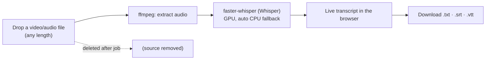

# Local Transcriber

> Transcribe any-length video or audio on your own machine with OpenAI's Whisper. No cloud, no file-size cap, no paywall.

**Source is private by design** — public showcase only.

<!-- drop a screenshot of the live-transcript UI here: assets/hero.png -->

---

## The problem
Cloud transcription tools cap file size, hide good models behind a paywall, and make you upload your private recordings to someone else's server. For long talks, client calls, or anything sensitive, that's the wrong trade.

## What it does
- **Drag and drop** a video or audio file of **any length** (a 30-minute talk is fine).
- Runs **OpenAI Whisper locally** (via `faster-whisper`) on your GPU — a 30-minute file finishes in ~1-3 minutes — and falls back to CPU automatically if needed.
- Export as **plain text (.txt), subtitles (.srt), or web captions (.vtt)**.
- Source files are **deleted after each job**. Nothing ever leaves your computer.

## How it's built

## Tech
| Layer | Stack |
|---|---|
| Server | Python + FastAPI (local web server) |
| Transcription | faster-whisper (Whisper) + ffmpeg, GPU/CPU auto-select |
| UI | Local web page (HTML/CSS/JS) at localhost |

## Status
Working local tool. Multiple Whisper model tiers (Tiny → Large v3); models cached after first download; runs entirely offline once set up.

---

Built by **Jesse Jolly** · [SFX Tech Innovation](https://sfxtechinnovation.com) · [LinkedIn](https://linkedin.com/in/jessegjolly)

*Source code is private and proprietary. This repository showcases the product and its architecture only.*
