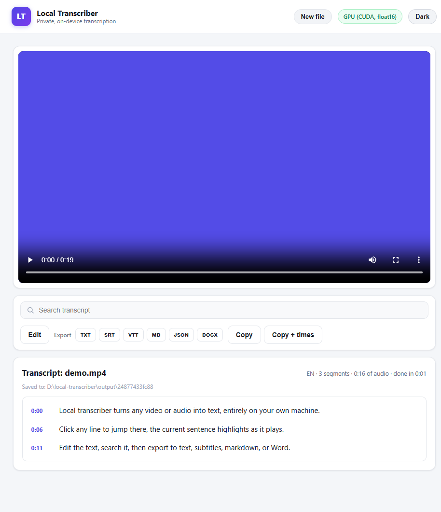
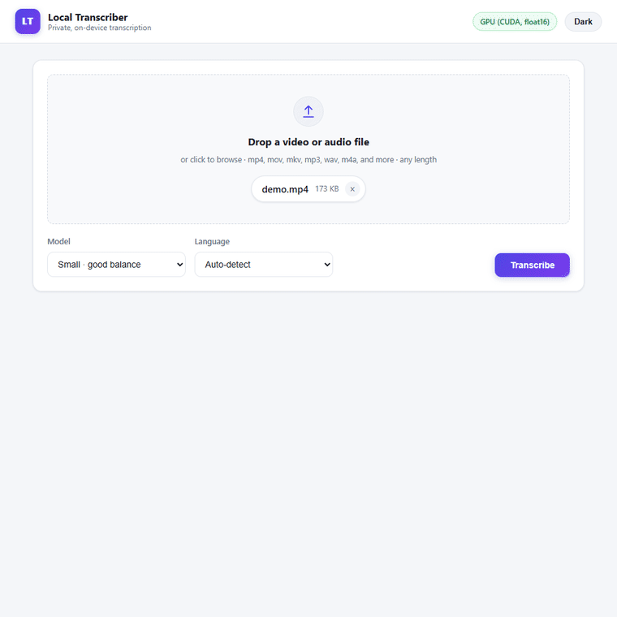
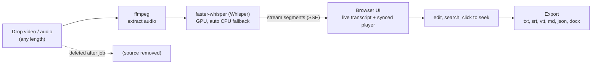
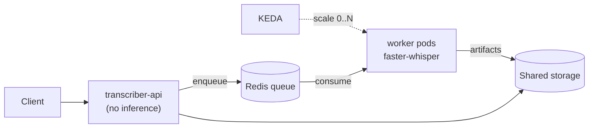

# Local Transcriber

> Turn any video or audio into text on your own machine with OpenAI's Whisper. No cloud, no file-size cap, no paywall, nothing ever uploaded.


[](https://linkedin.com/in/jessegjolly)



A premium, private alternative to tools like Otter.ai: a clean local web app that
transcribes your files with Whisper, plays them back in sync with the transcript,
and exports to six formats. Everything runs on your machine.

> **In plain terms:** This is a free app you run on your own computer that turns
> recordings into written text. Because nothing is sent to the internet, your
> private audio and video stay with you.



---

## The problem

> **In plain terms:** Most online transcription services limit how big your file
> can be, charge for the best quality, and require you to hand your recordings to
> their servers. That is a poor fit when the recording is long or private.

Cloud transcription tools cap file size, hide the good models behind a paywall, and
make you upload private recordings to someone else's server. For long talks, client
calls, or anything sensitive, that is the wrong trade.

## What it does

> **In plain terms:** You drag in a recording and get an editable, searchable
> transcript that plays back in step with the audio, and you can save it in six
> common file types. The original file is removed once the job finishes.

- **Drag and drop** a video or audio file of **any length** (a 30-minute talk is fine).
- Runs **OpenAI Whisper locally** (via `faster-whisper`) on your GPU when one is
  available (a 30-minute file can finish in a couple of minutes), and falls back to
  CPU automatically.
- **Live transcript** streams in as it runs, with a progress bar, time estimate, and
  a GPU/CPU badge.
- **Synced media player**: the file plays back in the browser and the current line
  highlights as it goes. Click any line to jump there.
- **Edit** the transcript inline, **search** it with highlighting, and **copy** it
  with or without timestamps.
- **Export** to plain text (`.txt`), subtitles (`.srt`), web captions (`.vtt`),
  Markdown (`.md`), JSON with timestamps (`.json`), and Word (`.docx`).
- Source files are **deleted after each job**. Nothing ever leaves your computer.
- Ships with a **CPU Docker image** so it runs anywhere, plus an optional GPU image.

## How it works

> **In plain terms:** The diagram below shows the path a file takes, from dropping
> it in, to pulling out the sound, to writing the words, to the transcript you can
> edit and export. All of it happens on your computer.



The browser embeds your file with a local object URL, so playback and sync happen
entirely on your machine. Text exports are built in the browser (so they honor your
edits); the Word export is built locally by the server with `python-docx`.

## Quickstart

> **In plain terms:** These are the two ways to install and start the app, one for
> Windows and one that works on any system. Pick whichever matches your setup and
> follow the numbered steps.

### Windows (no Docker)

1. Install [Python 3.11](https://www.python.org/downloads/) and
   [ffmpeg](https://ffmpeg.org/download.html) (on your PATH, or set `FFMPEG_PATH`).
2. Double-click **`setup.bat`** once. It builds a virtual environment and installs
   the pinned dependencies.
3. Double-click **`run.bat`**. A browser opens at <http://localhost:8765>.
4. Drop a file, pick a model and language, click **Transcribe**.

### Docker (any platform)

```bash
docker compose up --build      # CPU image, then open http://localhost:8765
```

Transcripts are written to your local `output/` folder, and Whisper models download
once into a persistent cache volume (never re-downloaded). For NVIDIA GPUs, an
optional image is provided (needs the NVIDIA Container Toolkit):

```bash
docker compose --profile gpu up --build gpu
```

### Which model?

| Model | Speed | Accuracy | Use it for |
|-------|-------|----------|------------|
| Tiny / Base | fastest | rough | quick drafts |
| **Small** | fast | good | the sensible default |
| Medium | slower | better | cleaner results |
| **Large v3** | slowest | best | important transcripts (great on a GPU) |

Models download once (Small ~0.5 GB, Large v3 ~3 GB) and are cached after that.

## Tech

> **In plain terms:** This is the list of the main software pieces the app is built
> from, grouped by the job each one does. It is here so engineers can see the parts
> at a glance.

| Layer | Stack |
|---|---|
| Server | Python 3.11 + FastAPI, server-sent events for live streaming |
| Transcription | faster-whisper (Whisper) + ffmpeg, GPU/CPU auto-select with a real CUDA self-test |
| UI | Local web page (HTML/CSS/JS), light theme with a dark toggle, synced player |
| Exports | txt / srt / vtt / md / json in the browser, docx via python-docx |
| Packaging | Docker (CPU and optional GPU), persistent model-cache volume |

## Testing

> **In plain terms:** There is a quick built-in check you can run to confirm the
> core pieces still work before you rely on the app. It finishes fast and needs no
> internet.

A fast, offline smoke test verifies the formatters and the real ffmpeg to
faster-whisper pipeline:

```bash
python test_smoke.py        # prints SMOKE TEST PASSED, exits 0 on success
```

See [`TESTING.md`](TESTING.md) for the full manual checklist.

## Status

> **In plain terms:** This is a short, honest summary of how finished the project is
> right now and what already works. It helps you know what to expect.

Working, tested, and containerized. Runs fully offline once a model is cached.
Light theme by default with an optional dark mode, synced playback, inline editing,
search, and six export formats. CPU image verified; optional GPU image provided.

## Scale it: Kubernetes + KEDA

> **In plain terms:** This section describes a bigger setup for handling many
> recordings, or several people submitting at once, where extra helpers start up only
> when there is work and shut off when idle. The everyday app above does not need this.

The single-process app above is one shape of this pipeline. For a backlog of long
recordings, several people submitting at once, or a GPU you want to keep busy without
paying for it while idle, there is a second shape: an async, queue-based service that
autoscales Whisper workers **from zero** on queue depth and back to zero when quiet.



Same `transcribe_core`, wrapped in a thin FastAPI, a Redis work queue, and a
KEDA-scaled worker pool. Proven on Docker Desktop Kubernetes: zero to four workers
and back to zero on queue depth, jobs transcribed and returned through the API. Try
it with `make k8s-up && make demo`. Full writeup, chart, and the captured scaling
proof are in [`deploy/README.md`](deploy/README.md).

## License

MIT. See [`LICENSE`](LICENSE).

---

Built by **Jesse Jolly** &middot; [SFX Tech Innovation](https://sfxtechinnovation.com) &middot; [LinkedIn](https://linkedin.com/in/jessegjolly)
