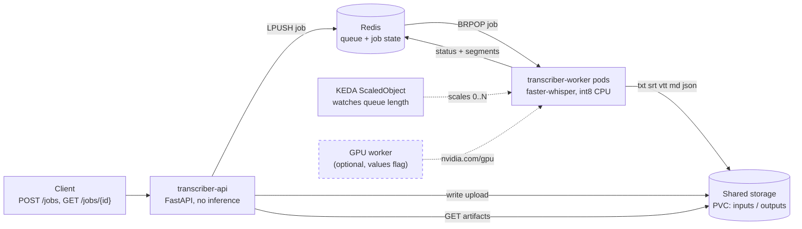

# Local Transcriber on Kubernetes

> The same offline Whisper pipeline, now as an async service that autoscales workers from zero on queue depth and back to zero when idle. Submit a job, KEDA spins up a worker, it transcribes, writes artifacts, and the cluster goes quiet again.


[](https://linkedin.com/in/jessegjolly)

This is the horizontally scalable face of [Local Transcriber](../README.md). The
single-process web app is still there and unchanged. This layer wraps the same
`transcribe_core` in a thin API, a Redis work queue, and a pool of Whisper workers
that KEDA scales on demand. An idle service costs nothing, because there are no
workers running when the queue is empty.

## Why this exists

The interactive app is one process: you drop a file, it transcribes, you watch it
stream. That is the right shape for one person at a desk. It is the wrong shape for a
backlog of long recordings, several people submitting at once, or a GPU you want to
keep busy without paying for it while it sits idle.

So this layer turns the same pipeline into a queue. The API does no inference; it
just accepts an upload, enqueues a job, and reports status. Workers do all the work,
and there are exactly as many of them as the queue needs: zero when nothing is
waiting, up to a ceiling when the backlog is deep. KEDA is what reads the queue and
moves that number, so the cluster matches the load instead of guessing at it.

## Topology



The client only ever talks to the API. The API and the workers share state through
Redis (the queue plus one hash per job) and share files through a PVC (`inputs/{id}`
and `outputs/{id}`). KEDA sits to the side: it reads the queue length and sets the
worker replica count, including all the way down to zero. The GPU worker is the same
worker with a GPU request bolted on, drawn dashed because it is an optional path.

## Quick start (CPU, Docker Desktop)

Enable Kubernetes in Docker Desktop, confirm `kubectl config current-context` is
`docker-desktop`, then from the repo root:

```bash
# 1. Build the image, install KEDA + Redis + the chart, wait for it to be ready.
make k8s-up

# 2. Submit a few synthesized sample jobs and watch workers scale up from zero.
make demo

# 3. (optional) In another terminal, watch the scaling live.
kubectl get pods -w -l app.kubernetes.io/instance=lt

# 4. Tear it all down.
make k8s-down
```

`make demo` synthesizes its own short speech clips with ffmpeg (no real audio, no
user data), port-forwards the API, submits the jobs, and polls until they are done,
printing the worker pod count as it goes so you can watch zero become N become zero.

To drive it by hand instead:

```bash
kubectl port-forward svc/lt-local-transcriber-api 8000:8000 &
curl -F file=@clip.wav -F model=tiny -F language=en http://localhost:8000/jobs
curl http://localhost:8000/jobs/<job_id>
curl http://localhost:8000/jobs/<job_id>/artifacts/srt
```

## What is in the chart

| Component | Kind | Notes |
|---|---|---|
| `transcriber-api` | Deployment + Service | Thin FastAPI. Enqueues jobs, serves status and artifacts. No inference. |
| `transcriber-worker` | Deployment (KEDA scaled) | Consumes the queue, runs `transcribe_core.transcribe()`, writes five artifacts. Starts at 0 replicas. |
| Redis | Deployment + PVC | Broker (the work queue) and job state (one hash per job). |
| Shared storage | PVC (ReadWriteOnce) | `inputs/` and `outputs/` shared by API and workers. |
| Model cache | PVC (ReadWriteOnce) | Whisper weights download once and persist. |
| KEDA `ScaledObject` | keda.sh/v1alpha1 | The headline piece. Redis list trigger, `minReplicaCount: 0`, `maxReplicaCount: 5`. |

The autoscaler is the point, so it is worth seeing. The worker scales on the length
of the Redis list the API pushes to:

```yaml
# deploy/helm/local-transcriber/templates/keda-scaledobject.yaml
spec:
  scaleTargetRef:
    name: lt-local-transcriber-worker
  pollingInterval: 5        # check the queue every 5s
  cooldownPeriod: 30        # idle 30s before scaling toward zero
  minReplicaCount: 0        # scale to zero when the queue is empty
  maxReplicaCount: 5        # ceiling of concurrent workers
  triggers:
    - type: redis
      metadata:
        # Fully qualified, cross namespace DNS: the KEDA operator runs in its own
        # namespace and cannot resolve a bare service name in this one.
        address: lt-local-transcriber-redis.default.svc.cluster.local:6379
        listName: "transcribe:queue"
        listLength: "1"     # one queued job per replica
```

## GPU mode (documented, not verified here)

GPU is behind a values flag and is honest about its status: it is wired up but not
run on this machine, because there is no GPU node in this Docker Desktop cluster. It
is not claimed as a passing run.

```bash
helm upgrade --install lt deploy/helm/local-transcriber \
  --set worker.gpu.enabled=true \
  --set image.repository=local-transcriber-gpu
```

When enabled, the worker template adds `resources.limits."nvidia.com/gpu"`, an
optional `runtimeClassName`, and `nodeSelector` / `tolerations`, so the pod lands on
a GPU node and gets a device. The image is built from `Dockerfile.gpu` (CUDA base,
float16). On a single Docker Desktop node with no GPU, that path stays documented;
the CPU path below is the one that is proven.

## Proof: scale from zero on Docker Desktop

Captured on a single node `docker-desktop` cluster, tiny model, twelve jobs of 30s
synthesized clips. The worker count tracks the queue, peaks at four (ceiling is
five), drains, then returns to zero after the cooldown.

```text
19:11:53  desiredReplicas=0  pods=0  running=0  KEDA_active=False  queue=12
19:11:58  desiredReplicas=1  pods=1  running=1  KEDA_active=True   queue=11
19:12:07  desiredReplicas=4  pods=4  running=4  KEDA_active=True   queue=5
19:12:13  desiredReplicas=4  pods=4  running=4  KEDA_active=False  queue=0
...cooldown...
worker deployment  ->  0/0     (back to zero)
scaledobject       ->  READY=True  ACTIVE=False
hpa                ->  REPLICAS=0
```

A completed job, fetched through the API:

```json
{
  "job_id": "07ffafecbfeb",
  "status": "done",
  "model": "tiny",
  "duration": 3.52,
  "language": "en",
  "text": "This worker was scaled up from zero by KEDA on queue depth.",
  "artifacts": {
    "txt": "/jobs/07ffafecbfeb/artifacts/txt",
    "srt": "/jobs/07ffafecbfeb/artifacts/srt",
    "vtt": "/jobs/07ffafecbfeb/artifacts/vtt",
    "md":  "/jobs/07ffafecbfeb/artifacts/md",
    "json":"/jobs/07ffafecbfeb/artifacts/json"
  }
}
```

(The text is what the tiny model heard on a synthesized clip; accuracy is the
model's, the autoscaling is the point.)

## Storage note (single node vs many)

The shared PVC is `ReadWriteOnce`, which is correct for one node: the API and the
workers all schedule onto the same node and share the volume. To run workers across
several nodes, swap this for object storage (MinIO or an S3 bucket) or a
ReadWriteMany volume, and point `SHARED_DIR` at a mount of it. The code reads
`SHARED_DIR` and does not care what backs it, so that is a values and volume change,
not a code change.

## Tests

`tests/test_service.py` drives the queue with `fakeredis` and runs the worker on a
short synthesized clip, so it needs no real Redis and no real audio:

```bash
pip install -r requirements-cpu.txt -r requirements-dev.txt
pytest tests/ -v
```

It covers the queue contract (enqueue, dequeue, status transitions) and one full
worker pass (consume a job, transcribe, write all five artifacts). CI also runs
`helm lint` and renders the CPU and GPU template paths on every push.

## Status

Proven on Docker Desktop Kubernetes: the chart installs cleanly, KEDA scales the
workers from zero to four and back to zero on queue depth, and jobs transcribe and
return artifacts through the API. GPU mode is wired and documented but not run here,
because this cluster has no GPU node. Everything is local: no secrets, no client
data, synthesized sample audio only.

## License

MIT. See [`LICENSE`](../LICENSE).

---

Built by **Jesse Jolly** &middot; [SFX Tech Innovation](https://sfxtechinnovation.com) &middot; [LinkedIn](https://linkedin.com/in/jessegjolly)
